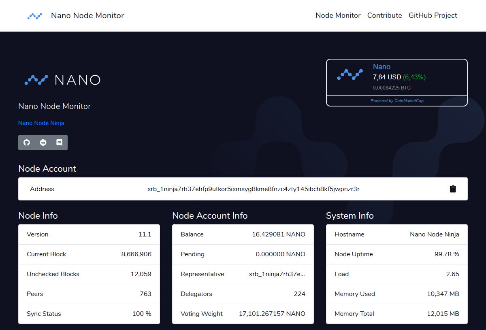
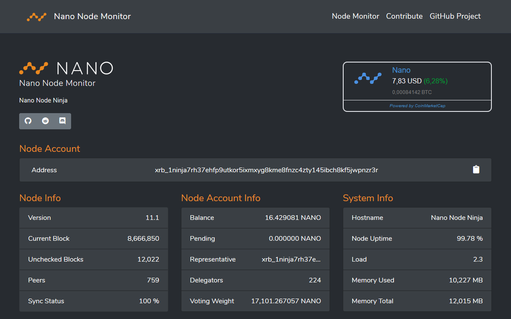
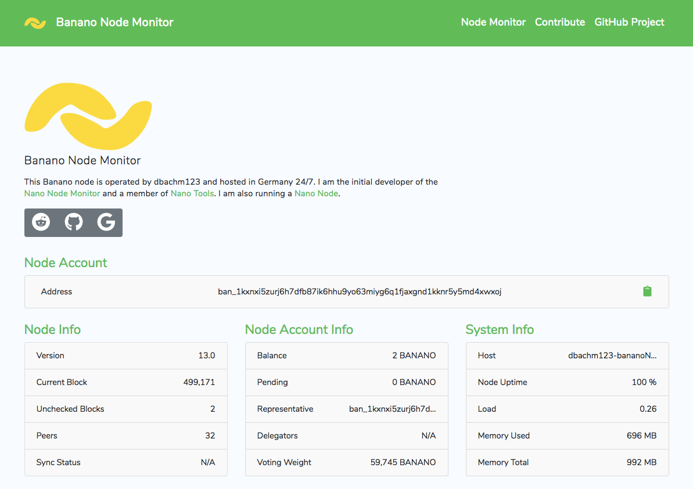
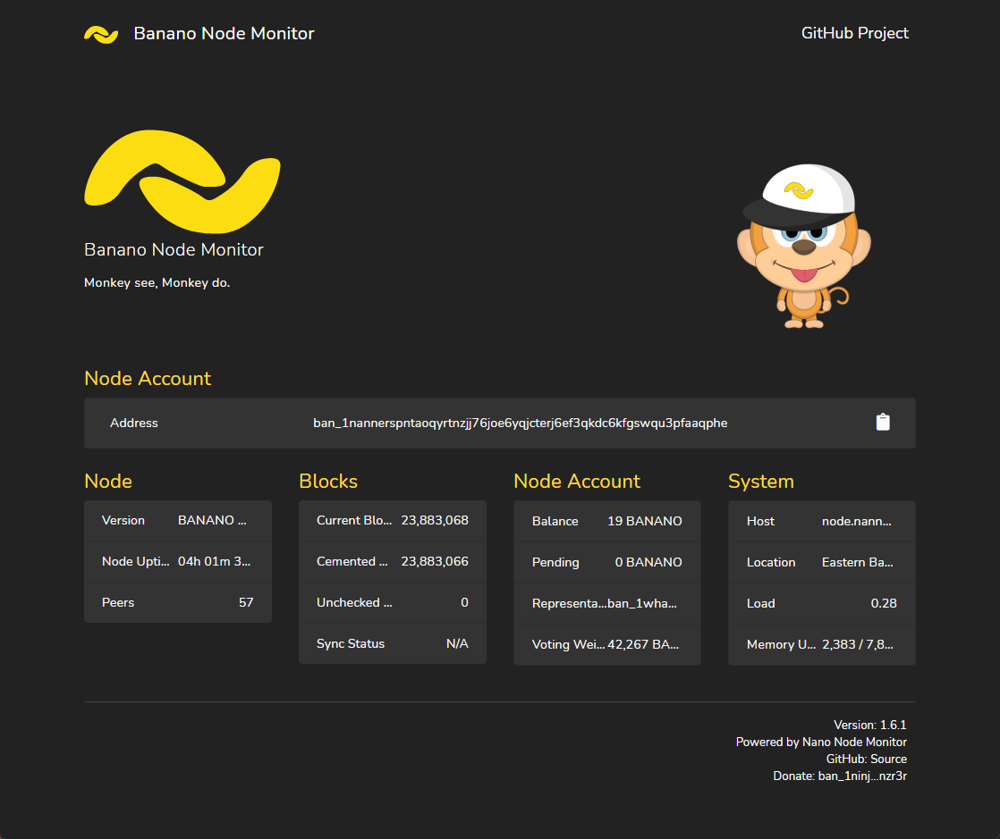
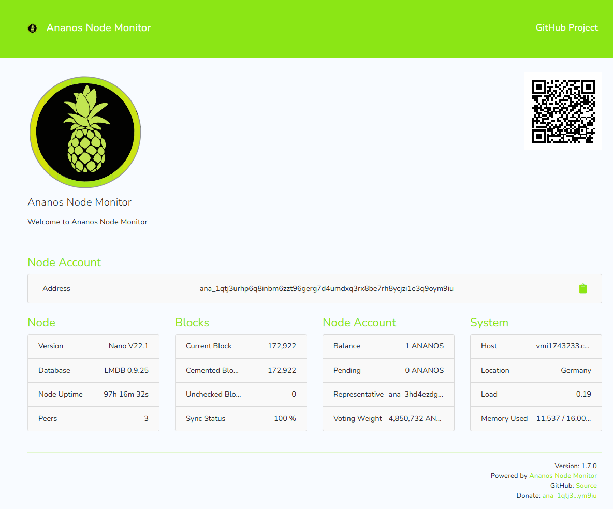
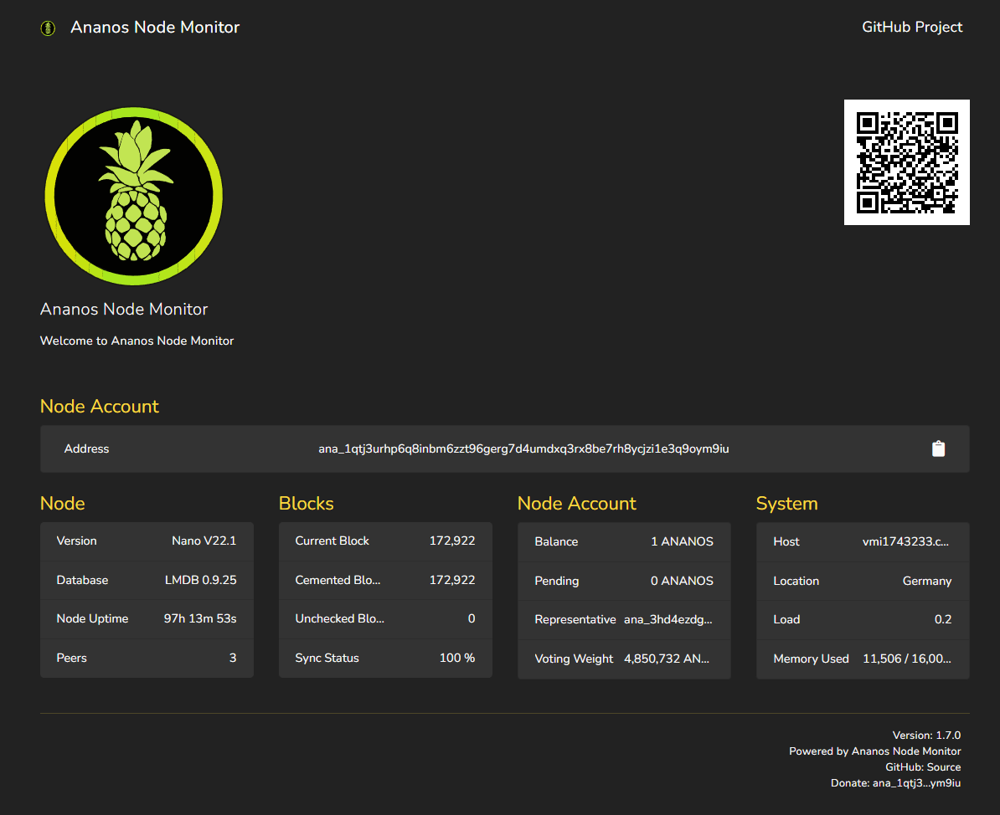

# Ananos Node Monitor

 [](https://styleci.io/repos/803179383)

Ananos Node Monitor is a server-side PHP-based monitor for Nano, Banano and Ananos nodes. It connects to a running node via RPC and displays it's status on a simple webpage. Being server-side, it does not expose the RPC interface of the Nano node to the public.

## Themes

|Nano Light|Nano Dark|Banano Light|Banano Dark|Ananos Light|Ananos Dark|
|-|-|-|-|-|-|
|||||||

## Manual Installation

### Prerequisites

- Running Ananos Node with RPC enabled ([Tutorial](https://docs.nano.org/running-a-node/node-setup/))
- Webserver with PHP 8.0
- PHP-Curl Module

    `sudo apt-get install php-curl`

### Installation

In your empty webserver directory, e.g. `/var/www/html`, execute:

    git clone https://github.com/AnanosNetwork/AnanosNodeMonitor .

If you want it to run a subdirectory remove the `.` at the end.

In the `modules` folder, create your own config file by executing:

    cp config.sample.php config.php

## Usage

You will have to add your node's account to the config file `config.php` by modifying the following lines. Make sure to remove the `//` in front of `$nanoNodeAccount`:

```
// account of this node
$nanoNodeAccount = 'ana_1qtj3urhp6q8inbm6zzt96gerg7d4umdxq3rx8be7rh8ycjzi1e3q9oym9iu';
```

Official documentation for creating an account on the node via RPC can be found at the following URL:

https://docs.nano.org/running-a-node/voting-as-a-representative/#step-2-setup-representative-account

If you are running a standalone node you might need to modify the IP-address and the port for the RPC in the file `config.php`. It should match the corresponding entries in `~/Nano/config.json`, e.g.

```
// ip address for RPC (default: [::1])
$nanoNodeRPCIP   = '127.0.0.1';

// ip address for RPC (default: 7076)
$nanoNodeRPCPort = '7076';
```

## Orginal Project

Thanks to grate work of [NanoTools team](https://github.com/NanoTools) 

https://github.com/NanoTools/nanoNodeMonitor
